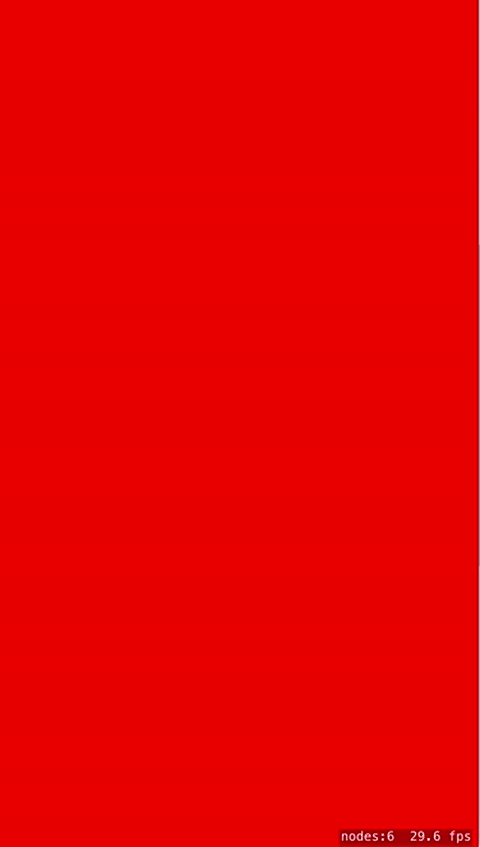

# Scrolling-On-2-Axis

 This example show how to create an endless scrolling background along two axis. 
 
 There are four background sections, really just Spite nodes, each equal in size 
 to the scene view. These should be this size or larger. Background sections that 
 move out of view of the camera move to the left or right, up or down and become 
 the next background section moving into view. In other words, a background section
 moving off the left, as the camera moves to the right, is moved to right side of 
 the currntly visible background section. The same is applied to vertical movement. 
 
 Background sections should be the size of the screen or larger. The example as 
 written here uses the size of the view. If you make background sections larger
 you will need to use that size in the scrollSceneNodes() methods.

